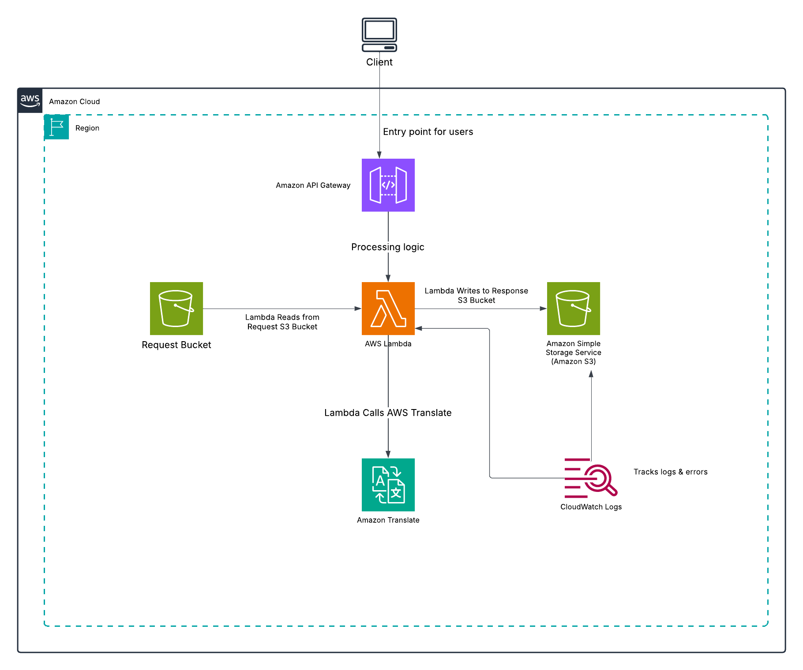

# Automated Language Translation Service

This Terraform project provisions an AWS-based translation service that enables automated language translations using AWS Lambda and Amazon Translate. The infrastructure is designed to be secure, scalable, and modular, following Infrastructure-as-Code (IaC) best practices.

The project consists of the following key AWS services:

Amazon S3: Stores incoming translation requests and the translated responses.
AWS Lambda: Executes the translation logic using AWS Translate.
Amazon API Gateway: Provides an HTTP endpoint for users to submit text for translation.
AWS Key Management Service (KMS): Ensures encryption of sensitive data across all resources.

---

## **Project Overview**
The architecture is designed to be scalable, serverless, and efficient. It includes:
1. **API Gateway**: Provides a secure endpoint for users to upload translation requests and retrieve results.
2. **Lambda**: Executes the translation logic using a Python script integrated with **Boto3**.
3. **S3**: 
   - Stores translation requests and responses.
   - Serves as a logging mechanism for tracking input and output files.
4. **AWS Translate**: Performs the language translation.

---

## **Architecture**



1. Users upload JSON files containing text to be translated via API Gateway.
2. The request is routed to a Lambda function.
3. The Lambda function:
   - Fetches the input JSON file from the S3 bucket.
   - Processes it using AWS Translate.
   - Stores the translated output back in the designated S3 bucket.
4. API Gateway provides the endpoint for interacting with the service.

---


## **Features**
- **Serverless Architecture**: Fully managed by AWS services, ensuring high availability and scalability.
- **Automated Language Translation**: Supports multiple languages using AWS Translate.
- **Secure Data Storage**: Uses IAM roles and policies to secure S3 buckets and other resources.

---

## **Prerequisites**
1. AWS account with access to:
   - **API Gateway**
   - **Lambda**
   - **S3**
   - **AWS Translate**
2. Terraform installed on your local machine.

---

## **Deployment**
Follow these steps to deploy the project infrastructure:

1. Clone the repository:
   ```bash
   git clone https://github.com/your-username/language-translation-aws-iac-solution.git
   cd aws-translate-service
```
2. Initialize Terraform
   ```bash
   terraform init -backend-config=backend.tfvars
```
3. Validate the Configuration
   ```bash
   terraform validate
```
4.  Plan the Deployment
   ```bash
   terraform plan
```
5. Apply the Deployment
   ```bash
   terraform apply -auto-approve
```
6. Retrieve the API Gateway URL
   ```bash
   terraform output translation_api_gateway_url
```

## Security Considerations
- IAM Role Least Privilege: The Lambda function and API Gateway have restricted permissions.
- S3 Bucket Encryption: All S3 objects are encrypted using AWS KMS.
- API Gateway Authorization: The API is protected via IAM authentication.
- Terraform State Security: State files are stored in an S3 backend with DynamoDB locking