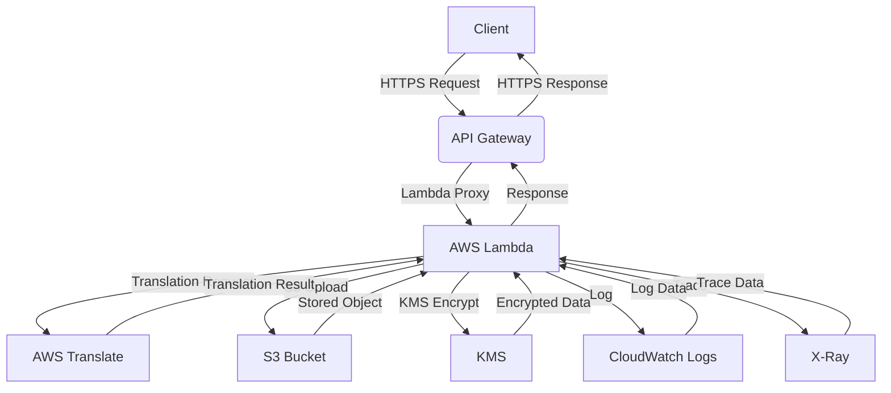

# 🌐 AWS Translation Service

A serverless language translation service built with AWS Lambda, API Gateway, and S3.

## ✨ Features

- **Multi-language Translation**: Support for English, Spanish, French, German, Chinese, Japanese, Korean, Portuguese, Italian, and Russian
- **Serverless Architecture**: Built on AWS Lambda for scalability and cost-efficiency
- **RESTful API**: API Gateway with CORS support for web applications
- **Web Interface**: Responsive frontend hosted on S3
- **Security**: KMS encryption and IAM role-based access control
- **Monitoring**: CloudWatch logging and X-Ray tracing

## 🏗️ Architecture



## 🚀 Getting Started

1. **Clone the Repository**:
    ```bash
    git clone https://github.com/yourusername/aws-translation-service.git
    cd aws-translation-service
    ```

2. **Deploy the Infrastructure**:
    ```bash
    terraform init
    terraform apply
    ```

3. **Configure the API Gateway**:
    - Set up the API methods and resources.
    - Enable CORS for web access.

4. **Upload the Frontend**:
    - Build the frontend application.
    - Upload to the designated S3 bucket.

5. **Test the Service**:
    - Access the API Gateway endpoint.
    - Send translation requests and receive responses.

## 📂 Repository Structure

- **infrastructure/**: Terraform scripts for AWS resources
- **lambda/**: AWS Lambda function code
- **frontend/**: Web interface source code
- **scripts/**: Helper scripts for deployment and management
- **docs/**: Documentation and architecture diagrams

## 📜 License

This project is licensed under the MIT License - see the [LICENSE](LICENSE) file for details.

---

# README for the Lambda Module

 **Module Name:** `lambda`  
 **Purpose:** This Terraform module provisions an **AWS Lambda function** to process **translation requests**. It integrates with **S3 buckets**, **AWS Translate**, and **KMS encryption**.

---

## ** Features**
- ✅ Creates a **Lambda function** with Python 3.12.  
- ✅ Configures **IAM roles & policies** for security.  
- ✅ Enables **logging** with CloudWatch Logs.  
- ✅ Provides **KMS encryption** for secure data handling.  
- ✅ Supports **environment-specific deployments** via variables.  

---

## ** Module Structure**

lambda/ │── data.tf # Defines dependencies like IAM policy & archive file
- iam.tf # Creates IAM roles & permissions for Lambda
─ main.tf # Creates the Lambda function & CloudWatch logging
─ outputs.tf # Exports Lambda function details
─ variables.tf # Defines input variables for customization
─ README.md # Documentation for the module
─ lambda_translate.py # Python script for translation 

## ** Usage**
To use this module, include it in your Terraform configuration:

```hcl
module "lambda_translate" {
  source              = "./modules/lambda"
  function_name       = "translate-function"
  function_handler    = "lambda_translate.lambda_handler"
  request_bucket      = module.s3_request.bucket_name
  response_bucket     = module.s3_response.bucket_name
  request_bucket_arn  = module.s3_request.bucket_arn
  response_bucket_arn = module.s3_response.bucket_arn
  kms_key_id          = module.kms_key.key_arn
  tags                = var.tags
  project             = var.project
  environment         = var.environment
  region              = var.region
}
```

## 🚀 Deployment

### Prerequisites
- AWS CLI configured
- Terraform installed
- Valid AWS credentials

### Deploy Infrastructure

```bash
# Initialize Terraform
terraform init

# Plan deployment
terraform plan

# Deploy to AWS
terraform apply
```

├── modules/
│   ├── api_gateway/     # API Gateway configuration
│   ├── lambda/          # Lambda function code and config
│   ├── s3_frontend/     # Frontend hosting
│   ├── s3_buckets/      # S3 storage buckets
│   └── kms_key/         # KMS encryption
├── main.tf              # Main Terraform configuration
├── variables.tf         # Input variables
├── outputs.tf           # Output values
└── README.md           # This file

## 8. Add and Push README

```bash
# Add README and push
git add README.md
git commit -m "📚 Add comprehensive README documentation"
git push
```

# Create a release tag
git tag -a v1.0.0 -m "🎉 Release v1.0.0 - Complete AWS Translation Service

✅ Serverless translation API
✅ Web frontend interface  
✅ Multi-language support
✅ Production-ready infrastructure
✅ Comprehensive documentation"

# Push the tag
git push --tags